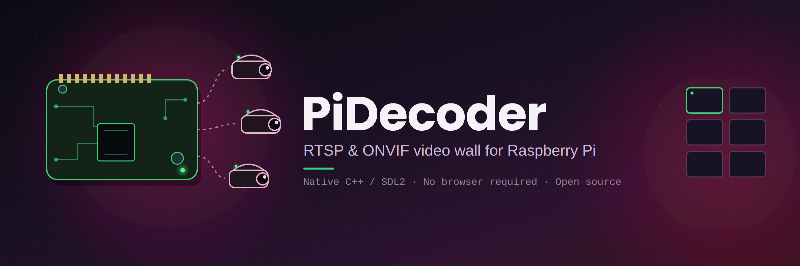
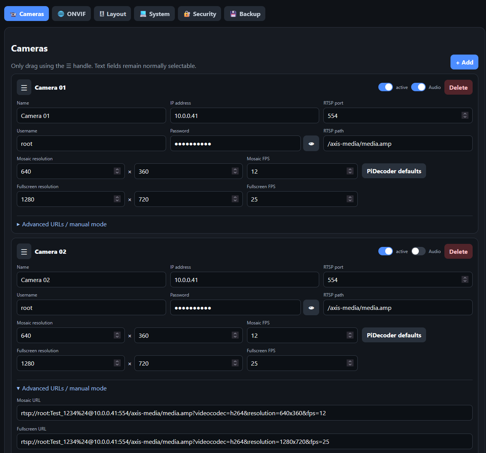
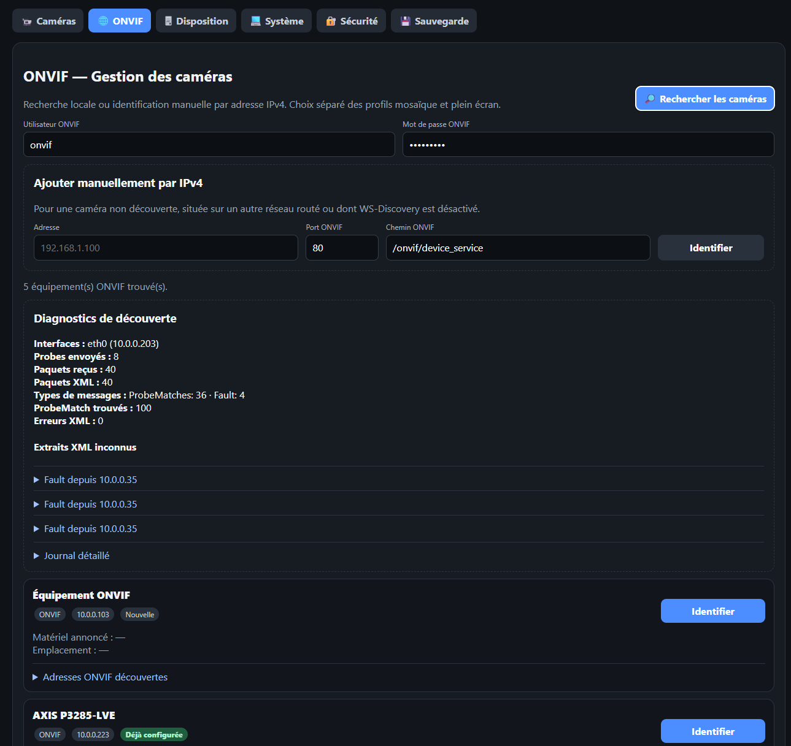
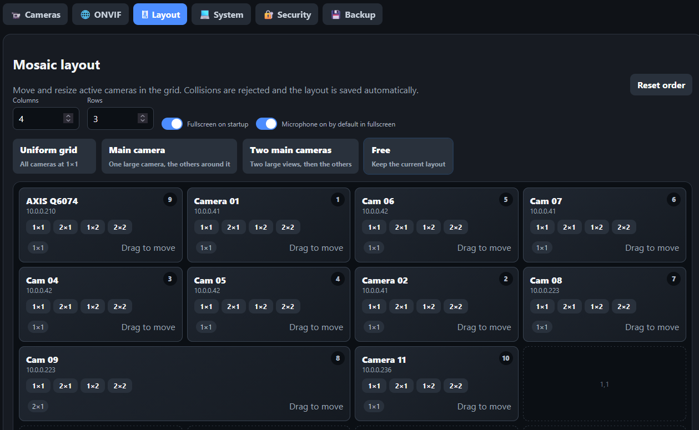
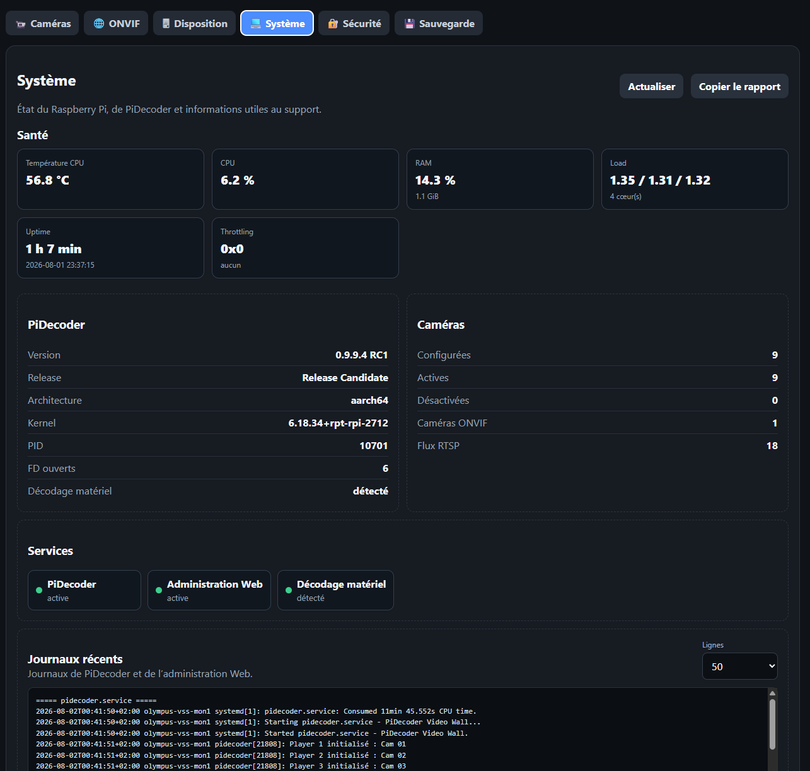
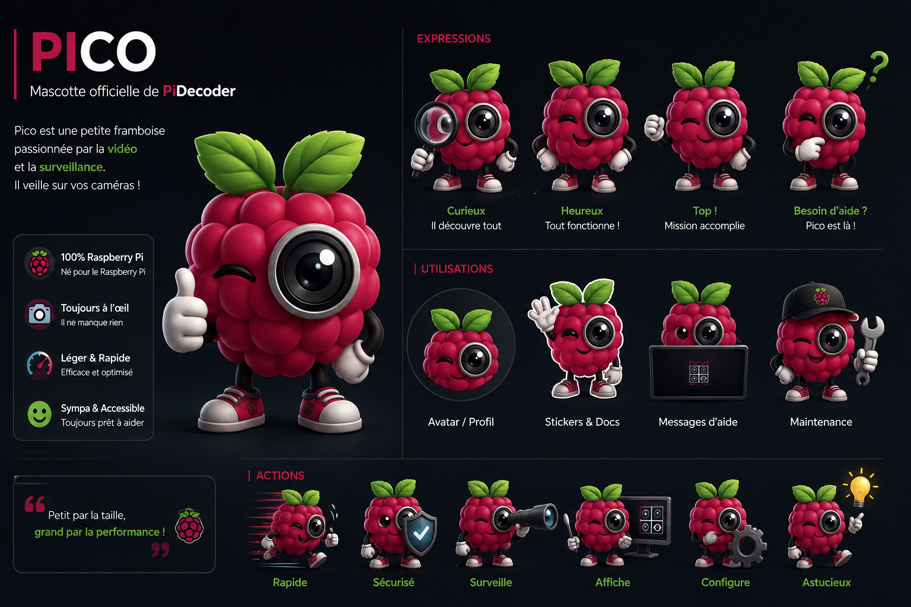

<p align="center">
  
</p>

<p align="center">
  <a href="https://github.com/PiDecoder/PiDecoder/actions/workflows/validate.yml">
    
  </a>
  
  
  
  
</p>

<p align="center">
  <strong>A fast, lightweight and reliable RTSP & ONVIF video wall for Raspberry Pi.</strong>
</p>

<p align="center">
  PiDecoder turns a Raspberry Pi 5 into a dedicated multi-camera display with a native video engine,
  ONVIF discovery, flexible layouts and a modern Web administration interface.
</p>

---

> [!NOTE]
> **PiDecoder v0.9.9.4 RC1** is the current release candidate.
> It is validated on a Raspberry Pi 5 running Debian 13 and Wayland.
> The upgrade path, configuration preservation, automatic startup and an 8+ hour continuous run
> have been successfully tested on real hardware.
> A fresh installation on a blank Debian 13 system, Web configuration restore and a forced-failure
> installer rollback have also been successfully validated.
>
> The blank-system installation test was performed on an x86_64 virtual machine.
> Raspberry Pi 5 AArch64 remains the official validated hardware target.
>
> The Web administration interface is currently available in French.
> English localization is planned before the stable v1.0 release.

## Why PiDecoder?

PiDecoder focuses on one job: displaying IP cameras reliably without the weight and complexity of a full Video Management System.

<table>
  <tr>
    <td width="25%" valign="top">
      <strong>Fast</strong><br>
      Native C++ video wall built around SDL2 and libmpv.
    </td>
    <td width="25%" valign="top">
      <strong>Lightweight</strong><br>
      Designed specifically for Raspberry Pi 5 and continuous display.
    </td>
    <td width="25%" valign="top">
      <strong>Practical</strong><br>
      Configure cameras, layouts and services from a Web interface.
    </td>
    <td width="25%" valign="top">
      <strong>Open</strong><br>
      GPLv3 project built around RTSP, ONVIF and standard Linux tools.
    </td>
  </tr>
</table>

## Features

| Video wall | ONVIF | Layout | Administration |
|---|---|---|---|
| Multiple RTSP streams | Automatic discovery | Drag and drop | Web interface |
| H.264 playback | Manual IPv4 addition | Resize camera tiles | System diagnostics |
| Automatic reconnection | Profile detection | Main-camera layout | Service controls |
| Fullscreen display | RTSP URI extraction | Persistent configuration | Logs and backups |
| Native Raspberry Pi display | Camera configuration | Flexible mosaics | Authentication |

## Preview

<table>
  <tr>
    <td width="50%" align="center">
      <br>
      <strong>Camera management</strong>
    </td>
    <td width="50%" align="center">
      <br>
      <strong>ONVIF discovery</strong>
    </td>
  </tr>
  <tr>
    <td width="50%" align="center">
      <br>
      <strong>Mosaic layout editor</strong>
    </td>
    <td width="50%" align="center">
      <br>
      <strong>System diagnostics</strong>
    </td>
  </tr>
</table>

## Documentation

| Guide | Description |
|---|---|
| [Installation and updates](docs/installation.md) | Requirements, installer options, updates and systemd startup |
| [Camera configuration](docs/configuration.md) | RTSP streams, credentials, camera order and applying changes |
| [ONVIF camera setup](docs/onvif.md) | Discovery, manual identification, profiles and camera updates |
| [Mosaic layout](docs/layout.md) | Grid size, templates, moving and resizing camera tiles |
| [Backup and restore](docs/backup.md) | Web exports, runtime backups and installer recovery |
| [FAQ and troubleshooting](docs/faq.md) | Common startup, RTSP, ONVIF and Wayland issues |

The public documentation is currently written in English.
The Web administration interface remains in French in v0.9.9.4 RC1; English localization is planned before the stable v1.0 release.

## Quick start

### 1. Clone PiDecoder

```bash
git clone https://github.com/PiDecoder/PiDecoder.git
cd PiDecoder
```

### 2. Run the preflight check

```bash
sudo ./scripts/install.sh --check
```

The preflight validates the operating system, architecture, desktop user, Wayland session, dependencies and project sources without modifying the host.

When automatic user detection is not possible:

```bash
sudo ./scripts/install.sh --check --user YOUR_DESKTOP_USER
```

### 3. Install

```bash
sudo ./scripts/install.sh
```

The installer:

- installs the required Debian packages;
- builds PiDecoder in release mode;
- installs it under `/opt/pidecoder`;
- preserves an existing camera, layout and Web configuration;
- creates a backup under `/var/backups/pidecoder`;
- installs and enables the systemd services;
- starts the video wall when the Wayland session becomes available.

Open the administration interface at:

```text
http://RASPBERRY_PI_IP:8080
```

## Safe updates

Update the repository and run the same installer again:

```bash
git pull
sudo ./scripts/install.sh
```

Existing runtime configuration is preserved automatically before the new version is installed.

## Startup architecture

```text
pidecoder-config.service
└── Web administration on port 8080

pidecoder-wayland.path
└── waits for /run/user/<uid>/wayland-0
    └── reaches pidecoder-wayland.target
        └── requests pidecoder.service
            └── native RTSP video wall
```

The Wayland path trigger prevents the video engine from starting before the graphical session is ready.
The intermediate target keeps the path unit healthy when no camera is configured; the video service
remains inactive until a valid camera configuration exists.

## Service status

```bash
systemctl status pidecoder-config.service --no-pager
systemctl status pidecoder-wayland.path --no-pager
systemctl status pidecoder-wayland.target --no-pager
systemctl status pidecoder.service --no-pager
```

Logs:

```bash
journalctl -u pidecoder-config.service -n 50 --no-pager
journalctl -u pidecoder.service -n 50 --no-pager
```

> [!WARNING]
> Camera configurations and some runtime logs can contain private RTSP addresses or credentials.
> Never publish them or commit them to the repository.

## Supported platform

| Component | Validated configuration |
|---|---|
| Hardware | Raspberry Pi 5 |
| Operating system | Debian 13 |
| Architecture | AArch64 |
| Display server | Wayland |
| Video engine | libmpv / FFmpeg |
| Rendering | SDL2 |
| Administration | Python 3 Web service |

Other Linux platforms may work, but they are not yet part of the validated v1.0 target.

## Current validation status

| Test | Status |
|---|---|
| Source and configuration validation | Passed |
| Existing installation upgrade | Passed |
| Camera and layout preservation | Passed |
| Web authentication preservation | Passed |
| Automatic startup after reboot | Passed |
| Wayland-triggered video startup | Passed |
| Continuous 8+ hour run | Passed |
| Fresh installation on blank Debian 13 x86_64 | Passed |
| Web configuration export and restore | Passed |
| Forced-failure installer rollback | Passed |

The Web configuration export contains cameras and layout data.
Administrator credentials are configured separately and are not included in the exported file.

## Roadmap

| Version | Status | Planned focus |
|---|---|---|
| v0.9.9.4 RC1 | Current | Release candidate and field testing |
| v1.0 | Next milestone | First stable public release and English localization |
| v1.1 | Planned | PTZ controls |
| v1.2 | Planned | Audio support |
| v1.3 | Planned | HTTPS |
| v1.4 | Planned | REST API |
| v2.0 | Long-term | Multi-Raspberry cluster |

Roadmap items are planned goals and may change as the project evolves.

## Project principles

- Keep it lightweight.
- Keep it fast.
- Keep it reliable.
- Keep it understandable.
- Do not add complexity without a real benefit.

## Contributing

Contributions, testing feedback and bug reports are welcome.

Before submitting a pull request:

1. Read [`CONTRIBUTING.md`](CONTRIBUTING.md).
2. Open an issue before proposing a major architectural change.
3. Keep commits focused and easy to review.
4. Never commit credentials, camera configurations or private logs.

Security issues should follow the process described in [`SECURITY.md`](SECURITY.md).

## License

PiDecoder is distributed under the GNU General Public License v3.0.

See [`LICENSE`](LICENSE) for the full license text.

---

<p align="center">
  
</p>

<p align="center">
  <strong>Pico is watching your cameras.</strong><br>
  Built for Raspberry Pi, RTSP and ONVIF.
</p>
