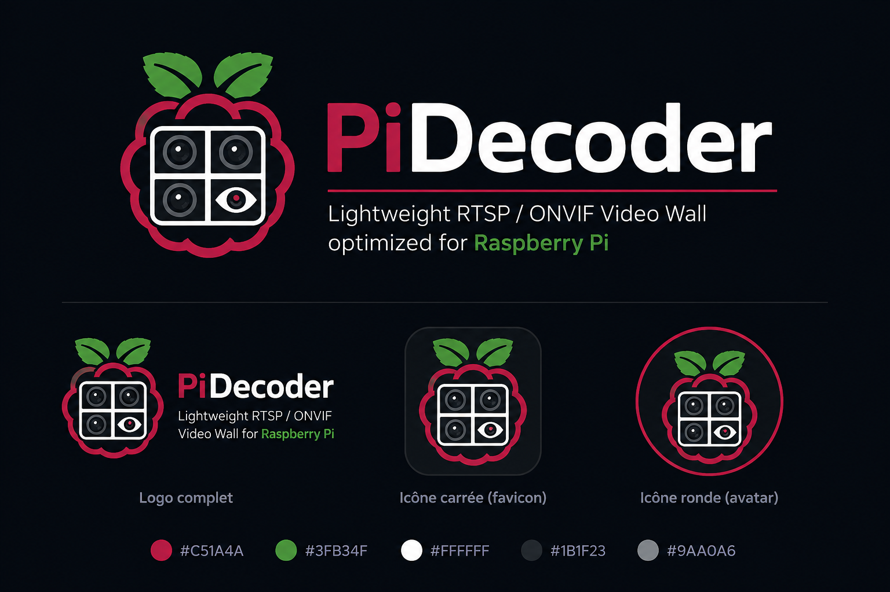

<p align="center">
  
</p>

<h1 align="center">PiDecoder</h1>

<p align="center">
<strong>Professional RTSP & ONVIF Video Wall built for Raspberry Pi</strong>
<br>
Lightweight • Hardware Accelerated • Modern Web Administration
</p>

<p align="center">


</p>

---

<p align="center">

</p>

---

# Why PiDecoder?

PiDecoder was created with a simple objective:

> **Provide a fast, lightweight and reliable RTSP & ONVIF Video Wall specifically designed for Raspberry Pi.**

Unlike many traditional Video Management Systems, PiDecoder focuses on simplicity, performance and ease of deployment while taking full advantage of Raspberry Pi hardware acceleration.

Whether monitoring a home lab, workshop, business or industrial site, PiDecoder delivers a responsive and modern surveillance experience without unnecessary complexity.

---

# Features

| 🎥 Video | 🔍 ONVIF | 🖥 Layout | ⚙ Administration |
|----------|----------|----------|------------------|
| RTSP Streaming | Automatic Discovery | Drag & Drop | Modern Web Interface |
| H264 | Manual IPv4 Add | Camera Resize | Diagnostics |
| JPEG | Profile Detection | Fullscreen View | Logs |
| Hardware Decoding | Camera Update | Zoom & Pan | Services |
| Auto Reconnect | RTSP URI Extraction | Flexible Layouts | Backup |
| Low CPU Usage | PTZ Ready | Main Camera Mode | Security |

---

# Screenshots

## Camera Management

<p align="center">

</p>

---

## ONVIF Discovery

<p align="center">

</p>

---

## Mosaic Layout Editor

<p align="center">

</p>

---

## System Diagnostics

<p align="center">

</p>

---

# Installation

Clone the repository

```bash
git clone https://github.com/PiDecoder/PiDecoder.git

cd PiDecoder
```

Configure and build

```bash
mkdir build

cd build

cmake ..

make -j$(nproc)
```

Install

```bash
sudo make install
```

---

# Supported Platform

PiDecoder is currently validated on:

- Raspberry Pi 5
- Debian 13
- Wayland
- SDL2
- FFmpeg
- libmpv

Support for additional Linux platforms will be expanded after the v1.0 release.

---

# Roadmap

| Version | Status |
|----------|--------|
| ✅ v1.0 | Stable Release |
| 🚧 v1.1 | PTZ Controls |
| 🚧 v1.2 | Audio Support |
| 🚧 v1.3 | HTTPS |
| 🚧 v1.4 | REST API |
| 🚀 v2.0 | Multi-Raspberry Cluster |

---

# Project Philosophy

PiDecoder follows a few simple principles:

- Keep it lightweight.
- Keep it fast.
- Keep it reliable.
- Keep it simple.

Every new feature should respect these principles.

---

# Contributing

Contributions are welcome.

Before submitting a Pull Request:

- Read `CONTRIBUTING.md`
- Open an Issue for major changes
- Keep commits focused
- Never commit credentials or private configuration files

---

# License

PiDecoder is distributed under the GNU General Public License v3.0.

See the `LICENSE` file for more information.

---

<p align="center">

</p>

<p align="center">
<strong>Pico is watching your cameras.</strong>
<br>
Thank you for supporting PiDecoder ❤️
</p>
